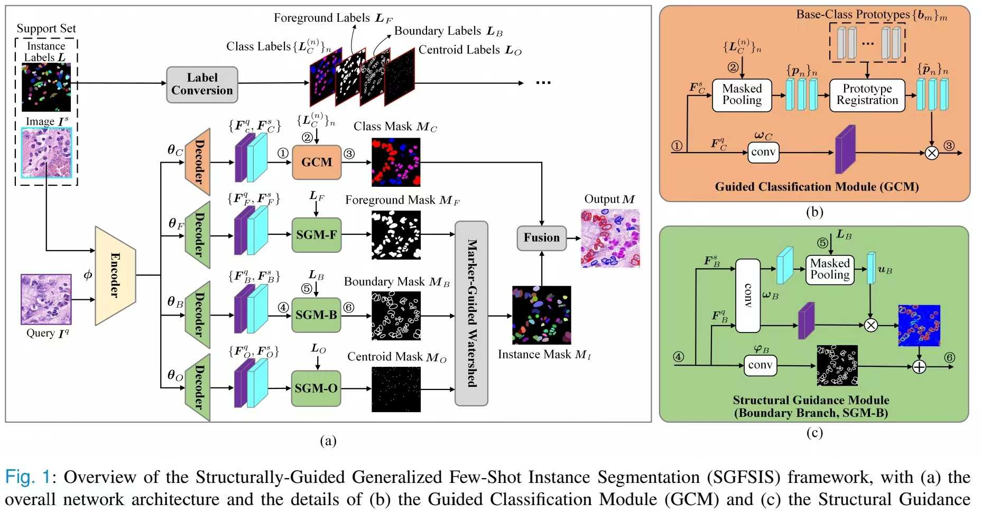

# SGFSIS

## Few-Shot Learning for Annotation-Efficient Nucleus Instance Seqmentation

**Abstract:** Nucleus instance segmentation from histopathology images suffers from the extremely laborious and expert-dependent annotation of nucleus instances. As a promising solution to this task, annotation-efficient deep learning paradigms have recently attracted much research interest, such as weakly-/semi-supervised learning, generative adversarial learning, etc. In this paper, we propose to formulate annotation-efficient nucleus instance segmentation from the perspective of few-shot learning (FSL). Our work was motivated by that, with the prosperity of computational pathology, an increasing number of fully-annotated datasets are publicly accessible, and we hope to leverage these external datasets to assist nucleus instance segmentation on the target dataset which only has very limited annotation. To achieve this goal, we adopt the meta-learning based FSL paradigm, which however has to be tailored in two substantial aspects before adapting to our task. First, since the novel classes may be inconsistent with those of the external dataset, we extend the basic definition of few-shot instance segmentation (FSIS) to generalized few-shot instance segmentation (GFSIS). Second, to cope with the intrinsic challenges of nucleus segmentation, including touching between adjacent cells, cellular heterogeneity, etc., we further introduce a structural guidance mechanism into the GFSIS network, finally leading to a unified Structurally-Guided Generalized Few-Shot Instance Segmentation (SGFSIS) framework. Extensive experiments on a couple of publicly accessible datasets demonstrate that, SGFSIS can outperform other annotation-efficient learning baselines, including semi-supervised learning, simple transfer learning, etc., with comparable performance to fully supervised learning with less than 5% annotations.



## Usage Tutorial:

### 1. Prepare Datasets:
First, you should download the ConSeP, MoNuSAC, Lizard, and PanNuke datasets. Then, process the images to a size of 256*256 pixels. After that, randomly sample from the training set 5 times.

### 2. Train the model:
Use an external dataset for pre-training the model.
- for ConSeP:
```shell
python 01_joint_training_on_ext_set.py --config ./config/ext_joint_training/consep.yaml
```
- for MoNuSAC:
```shell
python 01_joint_training_on_ext_set.py --config ./config/ext_joint_training/monusac.yaml
python 01_joint_training_on_ext_set.py --config ./config/ext_joint_training/monusac_20x.yaml # transfer to Lizard
```
- for PanNuke:
```shell
python 01_joint_training_on_ext_set.py --config ./config/ext_joint_training/pannuke.yaml
```

Fine-tune the model using a small-sample training set.
- for ConSeP -&gt; MoNuSAC:
```shell
python 02_fine_tuning_on_small_set.py --config .config/tsk_finetuning/ext_consep_tsk_monusac.yaml
```
- for MoNuSAC -&gt; Lizard:
```shell
python 02_fine_tuning_on_small_set.py --config .config/tsk_finetuning/ext_monusac20x_tsk_lizard.yaml
```
- for MoNuSAC -&gt; CoNSeP:
```shell
python 02_fine_tuning_on_small_set.py --config .config/tsk_finetuning/ext_monusac_tsk_consep.yaml
```
- for MoNuSAC -&gt; PanNuke:
```shell
python 02_fine_tuning_on_small_set.py --config .config/tsk_finetuning/ext_monusac_tsk_pannuke.yaml
```
- for PanNuke -&gt; MoNuSAC:
```shell
python 02_fine_tuning_on_small_set.py --config .config/tsk_finetuning/ext_pannuke_tsk_monusac.yaml
```
